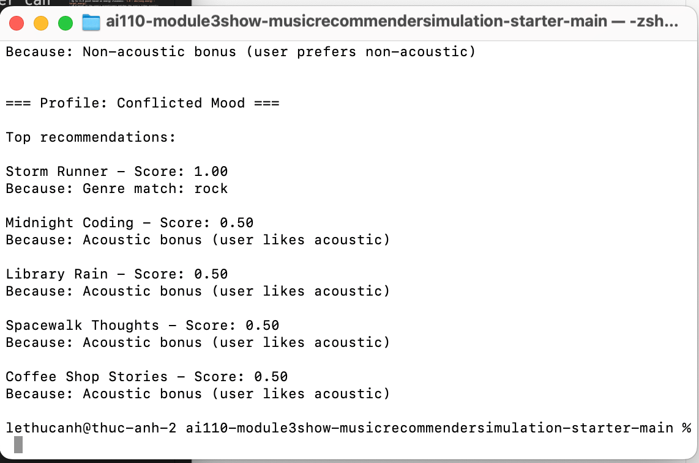

# 🎵 Music Recommender Simulation

## Project Summary

In this project you will build and explain a small music recommender system.

Your goal is to:

- Represent songs and a user "taste profile" as data
- Design a scoring rule that turns that data into recommendations
- Evaluate what your system gets right and wrong
- Reflect on how this mirrors real world AI recommenders

Replace this paragraph with your own summary of what your version does.

---

## How The System Works


This is a content-based recommender: it scores every song in `songs.csv` 
against a single `user_prefs` profile, rather than comparing behavior across 
multiple users.

**Algorithm Recipe (Final):**

- +2.0 points if the song's genre matches the user's favorite_genre
- +1.0 point if the song's mood matches the user's favorite_mood
- Up to +1.0 point based on energy closeness: `1.0 - abs(song.energy - target_energy)`
- +0.5 point if the song's acousticness matches the user's likes_acoustic 
  preference (acoustic songs for users who like acoustic, non-acoustic for 
  users who don't)

Max possible score per song: 4.5.


**Process:** every song is scored in a loop, then all scored songs are 
sorted descending by score, and the top K are returned as the final 
recommendations along with a human-readable explanation of why each song 
was chosen.

**Data flow:**
Input (user_prefs) → Process (loop scoring every song in songs.csv) → 
Ranking (sort by score) → Output (top K recommendations)

**Expected bias:** this system heavily prioritizes genre matches (worth 2x 
a mood match and 2x the max energy score), so a mediocre song in the right 
genre could outrank a great song that matches mood and energy perfectly but 
sits in a different genre. It also treats genre/mood as strict binary 
matches — a closely related genre (e.g. "indie pop" vs "pop") gets zero 
credit even if it would actually suit the user's taste.

**What features does each `Song` use in your system?**
- `genre` (e.g. pop, lofi, rock)
- `mood` (e.g. happy, chill, intense)
- `energy` (0–1, how intense/powerful the song feels)
- `valence` (0–1, how positive/upbeat the song feels)
- `acousticness` (0–1, how organic vs. electronic the song sounds)

**What information does your `UserProfile` store?**
- `preferred_genre` and `preferred_mood` (the categories the user wants matched)
- `preferred_energy`, `preferred_valence`, `preferred_acousticness` (target 
  values, 0–1, representing the user's ideal level for each)
- `feature_weights` (how much each feature matters, e.g. genre weighted 
  highest since it defines a song's broadest identity)

**How does your `Recommender` compute a score for each song?**
For categorical features (genre, mood), it awards full points for an exact 
match and zero otherwise. For numeric features (energy, valence, 
acousticness), it uses a *closeness* formula — `1 - abs(song_value - 
user_preference)` — so a song scores higher the closer it is to the user's 
preferred value, not simply for being higher or lower. Each feature score is 
then multiplied by its weight and summed into one total score per song.

**How do you choose which songs to recommend?**
Every song in the dataset is scored this way, then all songs are sorted by 
total score from highest to lowest. The top N songs from that sorted list 
become the recommendations.

Diagram:
```
Input: user_prefs (dict)
   │
   ▼
Process (Loop):
   for each song in songs.csv:
       score, reasons = score_song(user_prefs, song)
       → +2.0 if genre match
       → +1.0 if mood match
       → +1.0 max based on energy closeness
       → +0.5 if acoustic preference match
       store (song, score, explanation)
   │
   ▼
Ranking: sort all (song, score, explanation) descending by score
   │
   ▼
Output: Top K songs (song, score, explanation)

---

## Getting Started

### Setup

1. Create a virtual environment (optional but recommended):

   ```bash
   python -m venv .venv
   source .venv/bin/activate      # Mac or Linux
   .venv\Scripts\activate         # Windows

2. Install dependencies

```bash
pip install -r requirements.txt
```

3. Run the app:

```bash
python -m src.main
```

### Running Tests

Run the starter tests with:

```bash
pytest
```

You can add more tests in `tests/test_recommender.py`.

---

## Sample Recommendation Output

Paste a sample of your recommender's output here as a text block so a reader can see what it produces:

```
Top recommendations:

Storm Runner - Score: 2.99
Because: Genre match: rock; Energy similarity: 0.99

Golden Hour - Score: 1.10
Because: Energy similarity: 0.60; Acoustic bonus (user likes acoustic)

Velvet Hush - Score: 1.05
Because: Energy similarity: 0.55; Acoustic bonus (user likes acoustic)

Midnight Coding - Score: 1.02
Because: Energy similarity: 0.52; Acoustic bonus (user likes acoustic)

Focus Flow - Score: 1.00
Because: Energy similarity: 0.50; Acoustic bonus (user likes acoustic)
```

**Screenshot or video** *(optional)*: <!-- Insert a screenshot or demo video link here -->  

---

## Experiments You Tried

Use this section to document the experiments you ran. For example:

- What happened when you changed the weight on genre from 2.0 to 0.5
- What happened when you added tempo or valence to the score
- How did your system behave for different types of users

---

## Limitations and Risks

Summarize some limitations of your recommender.

Examples:

- It only works on a tiny catalog
- It does not understand lyrics or language
- It might over favor one genre or mood

You will go deeper on this in your model card.

---

## Reflection

Read and complete `model_card.md`:

[**Model Card**](model_card.md)

Write 1 to 2 paragraphs here about what you learned:

- about how recommenders turn data into predictions
- about where bias or unfairness could show up in systems like this


